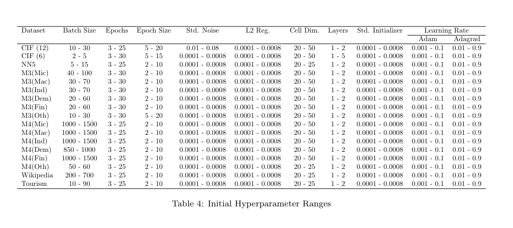
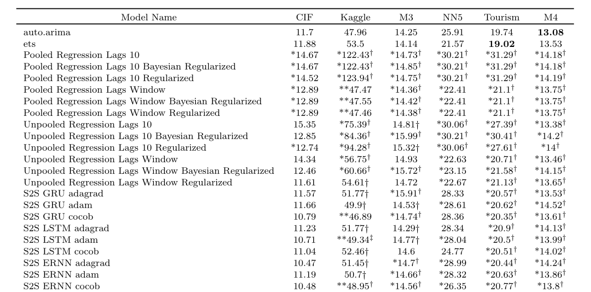

```{r setup, include=FALSE}
knitr::opts_chunk$set(echo = FALSE)
```

## Background 

Paper: 

- Hewamalage, Hansika, Christoph Bergmeir, and Kasun Bandara. 2021. “Recurrent Neural Networks for Time Series Forecasting: Current Status and Future Directions.” Interna- tional Journal of Forecasting 37 (1): 388–427.

Resource: 

- Olah, Christopher. 2015. “Understanding LSTM Networks.” https://colah.github.io/posts/2015-08-Understanding-LSTMs/. 


## Background 

- Time series forecasting has been traditionally a topic in statistics and econometrics, from simple methods such as Seasonal Naive and Simple Exponential Smoothing, to more complex ones such as ETS and ARIMA. 

- However, such traditional univariate techniques lack key features needed for advanced forecasting tasks. 

  - **Comment.** There are even more complex classes of models, such as state space models (SSMs).

- With the ever increasing availability of data, ANNs (Artificial Neural Networks) have become a popular technique for machine learning tasks. 


## RNN 

- RNNs (Recurrent Neural Networks) are the most commonly used neural networks architecture for sequence prediction problems. 

- Although most commonly used for natural language processing (NLP) tasks, these architectures are used in various time series forecasting tasks as well. 


## RNN

- An RNN is composed of repeating cells or units that unfold or unroll over time,

  - where each unit passes recurrent information stored in the hidden state from one time step to the next. 


## Recurrent Units

Commonly used units for sequence modelling tasks are: 

- Elman Recurrent Unit (ERNN)

- Long Short-Term Memory (LSTM) 

  - We will focus on the LSTM with a forget gate. This is the version implemented in `PyTorch`. 

  - Several LSTM variants exist, but their performance is generally comparable. 

- Gated Recurrent Unit (GRU)


## Elman Recurrent Unit


## Elman Recurrent Unit

Let $x_t$, $h_t$, and $y_t$ denote the input data, the hidden state, and the output at time $t$, respectively. Then, an RNN unit can be expressed as: 
\begin{equation}
\begin{split}
\label{eq:rnn}
h_t &= \sigma(W_{ih} h_{t-1} + W_{ix} x_t + b_i), \\
o_t &= tanh(W_{oh} \cdot h_t + b_o), 
\end{split}
\end{equation}

- $W$ denote the weight matrices, and $b$ the bias vectors, where subscripts $i$ and $o$ refer to the input and the ouput steps. 

- $\sigma$ and $tanh$ are the activation functions, the logistic sigmoid function and the hyperbolic tangent function, respectively. 


## Elman Recurrent Unit 

- The ERNN unit suffers from the well-known vanishing and exploding gradient problems when trained with Backpropagation Through Time (BPTT) over long sequences. 

- The LSTM unit was proposed to help capture long-term dependencies in sequences and alleviate the vanishing gradient problem. 

  - LSTM alleviates this issue to some extent. 
  
  - **Comment.** This is one reason why transformer-based model is increasingly applied to forecasting tasks, but it has its limitations too. 
 
 
## LSTM 

- An LSTM unit extends an RNN by introducing a cell state and three gates. 

  - The cell state carries long-term dependencies. The hidden state encodes short-term patterns. 
  
  - The gates (i.e., the forget, input, and output gates) regulate the flow of information. 


## LSTM 


## LSTM 

Let $f_t$, $i_t$, and $o_t$ represent the forget, the input, and the output gate vector at time $t$, respectively. Then, an LSTM unit can be expressed as: 
\begin{equation}
\begin{split}
\label{eq:lstm}
f_t &= \sigma(W_{fh} h_{t-1} + W_{fx} x_t + b_f), \\
i_t &= \sigma(W_{ih} h_{t-1} + W_{ix} x_t + b_i), \\
\tilde{c}_t &= \tanh(W_{\tilde{c} h} h_{t-1} + W_{\tilde{c} x} x_t + b_{\tilde{c}}), \\
c_t &= f_t \cdot c_{t-1} + i_t \cdot \tilde{c}_t, \\
o_t &= \sigma(W_{oh} h_{t-1} + W_{ox} x_t + b_o), \\
h_t &= o_t \cdot \tanh(c_t). 
\end{split}
\end{equation}

- $W$ denote the weight matrices, $b$ the bias vectors, 

- $\sigma$ and $tanh$ the logistic sigmoid function and the hyperbolic tangent function, respectively. 


## LSTM Step 1


- The forget gate, $f_t$, 

  - controls the extent to which information to discard or retain. 

  - outputs values in range $[0, 1]$, where $0$ means the information is completely discarded, and $1$ means it is fully retained. 
  

## LSTM Step 2


- The input gate, $i_t$, 

  - regulates the amount of new information to add or discard. 

  - also outputs values in in range $[0, 1]$, where $0$ means no information is added, and $1$ means it is fully added. 

- The network computes the candidate values, $\tilde{c}$, which represents the proposed new information. 


## LSTM Step 3


- Next, the cell state, $c_t$, is updated by combining the previous cell state, $c_{t-1}$, and the candidate values, $\tilde{c}$. 

- Recall that $f_t$ controls how much irrelevant information to discard, while $i_t$ determines how much new information to add when updating the cell state. 


## LSTM Step 4


- Then, the output gate, $o_t$, determines the extent to which the cell state, $c_t$, is exposed to the hidden state, $h_t$. 

- The hidden state, $h_t$, is updated by taking the cell state, $c_t$, and scaling it with the output gate, $o_t$. 


## GRU 


- GRU has gained popularity for its simpler design. 

  - Replace the forget and input gates with the reset gate.

  - Merge the cell state and hidden state. 


## Experimental Setup

The datasets used for the experiments are taken from the following forecasting competitions. 

- CIF 2016 Forecasting Competition Dataset 

- M3 Forecasting Competition Dataset 

- M4 Forecasting Competition Dataset 

- NN5 Forecasting Competition Dataset 

- Wikipedia Web Traffic Time Series Forecasting Competition Dataset 

- Tourism Forecasting Competition Dataset


## Experimental Setup

See the paper for details on other steps such as data splitting, STL decomposition (Seasonable and Trend Decomposition using Loess) , trend normalization, and mean normalization, as well as hyperparameter tuning and performance evaluations. 


## Results

- On the CIF, M3, M4, and Tourism datasets, no model is significantly better than the two benchmarks (i.e., ETS and ARIMA). 

- On the NN5 dataset, the RNN models have only managed to perform significantly better than ARIMA, but not ETS. 

- Across all the datasets, it can be seen that the RNN models which perform significantly better than the benchmarks are mostly the variants of the stacked architecture. 

  - **Comment.** See Table 5: Mean SMAPE Results in Supplement for details, if needed. But a better plot (i.e., Figure 20) is coming up. 


## Figure 13: Relative Performance of Different Recurrrent Cell Types


- The difference is not significant based on the p-value. 


## Figure 14: Relative Performance of Different Optimizers


- The difference is not significant based on the p-value. 


## Figure 20: Performance of RNNs Compared to Traditional Univariate Techniques (1/3)


- An RNN architecture is able to outperform the benchmark techniques on all the datasets except the M4 dataset. 

  - **Typo.** ETS has the lowest mean SMAPE for the Tourism datatset. 


## Figure 20: Performance of RNNs Compared to Traditional Univariate Techniques (2/3)


## Figure 20: Performance of RNNs Compared to Traditional Univariate Techniques (3/3)


## Figure 22: Performance of RNNs Compared to Traditional Univariate Techniques in Different M4 Categories (1/3)


- M3 and M4 span various domains, including microeconomics, macroeconomics, industry, finance, demography, and other sectors. 


## Figure 22: Performance of RNNs Compared to Traditional Univariate Techniques in Different M4 Categories (2/3)
 


## Figure 22: Performance of RNNs Compared to Traditional Univariate Techniques in Different M4 Categories (3/3)


## Recap of Datasets Used 

- CIF includes both artificially generated series and series originating from the banking domain. 

- M3 and M4 span various domains, including microeconomics, macroeconomics, industry, finance, demography, and other sectors. 

- NN5 (daily cash withdrawal amounts from UK ATMs), Wikipedia Web Traffic, and Tourism contain non-negative series, meaning that they also have 0 values. 


## Discussion 

**Comment.** I haven’t examined them in details, but I suspect the issue stems from inappropriate benchmarking and/or mishandling of time series characteristics. 

For example, 

- Are ETS and ARIMA suitable benchmarks for these datasets? 

- Can we trust RNNs to perform reliably without explicit assumptions? 


## Discussion 

The paper was published in 2021. Two of its authors later published “Forecast Evaluation for Data Scientists: Common Pitfallsand Best Practices” in 2023. Some highlights include: 

1. ML and DL techniques (including transformer-based architectures) are becoming competitive in time series forecasting. 

2. ML researchers often use inadequate benchmarking (e.g., overlooking non-stationarity or non-normality) or flawed evaluation methods, leading to misleading claims of superiority. 

3. Best practices are outlined with respect to the different steps such as data partitioning, error metrics, statistical testing, and more. 


## Thank you! 

\huge Thoughts? 


## References

Hewamalage, Hansika, Christoph Bergmeir, and Kasun Bandara. 2021. “Recurrent Neural Networks for Time Series Forecasting: Current Status and Future Directions.” International Journal of Forecasting 37 (1): 388–427.

Hewamalage, Hansika, Klaus Ackermann, and Christoph Bergmeir. 2023. “Forecast Evaluation for Data Scientists: Common Pitfalls and Best Practices.” Data Mining and Knowledge Discovery 37 (2): 788–832.

Olah, Christopher. 2015. “Understanding LSTM Networks.” https://colah.github.io/posts/2015-08-Understanding-LSTMs/. 


---

\huge Supplement


## Hyperparameter Tuning

The experiments require the proper tuning of a number of hyperparameters associated with the model training. 

Key hyperparameters important for training include:

1. Batch size

2. Number of Epochs 

3. Learning Rate 

4. Cell Dimension 

5. Number of Hidden Layers 

6. Etc.  

## Hyperparameter Tuning - Details

1. Batch size

  - the number of training samples or sequences processed simultaneously by the network in one forward and backward pass before updating its parameters. 
  
2. Number of Epochs 

  - the number of full forward and backward passes across the full dataset are required for the optimal training. 

3. Learning Rate 

  - controls how much the network’s parameters are adjusted during training in response to the gradients of the loss function. 
  

## Hyperparameter Tuning - Details

4. Cell Dimension 

  - the size of the hidden state vector, which corresponds to the number of neurons inside each recurrent cell. 
  
5. Number of Hidden Layers 

  - determines how many recurrent layers are layered on top of each other. 

6. Etc.  


## Hyperparameter Tuning - Cont. 

For tuning hyperparameters, there are several techniques, including:

1. Manual Search, also known as Manual Hyperparameter Tuning
  
2. Grid Search

3. Random Search


## Table 4: Initial Hyperparameter Ranges




## Figure 5: Stacked Architecture


## Figure 6: Multi-layer Stacked Architecture


## Table 5: Mean SMAPE Results (1/6)



## Table 5: Mean SMAPE Results (2/6)


## Table 5: Mean SMAPE Results (3/6)


## Table 5: Mean SMAPE Results (4/6)


## Table 5: Mean SMAPE Results (5/6)


## Table 5: Mean SMAPE Results (6/6)


## Error Metrics

\begin{table}[ht]
\centering
\begin{tabular}{lll}
\hline
\textbf{Metric} & \textbf{Definition} & \textbf{Formula} \\
\hline
SMAPE & Symmetric MAPE & $\frac{100}{T} \sum_{t=1}^{T} \frac{|y_t - \hat{y}_t|}{(|y_t| + |\hat{y}_t|) / 2}$ \\
MASE & Mean Absolute Scaled Error & $\frac{ \frac{1}{T} \sum_{t=1}^{T} |y_t - \hat{y}_t| }{ \frac{1}{T - 1} \sum_{t=2}^{T} |y_t - y_{t-1}| }$ \\
\hline
\end{tabular}
\end{table}
